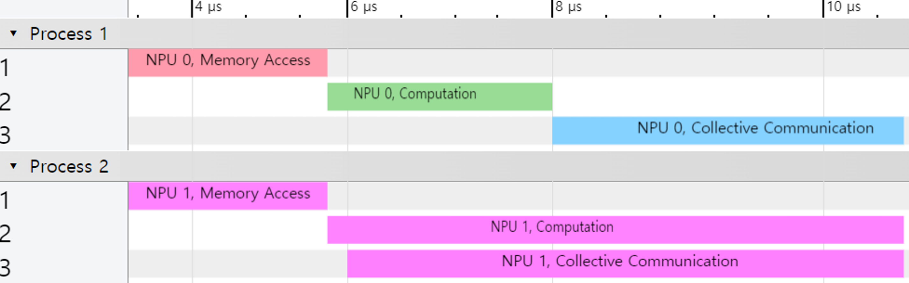

# Chakra User Guide
## Installation
### Step 1: Set up a Virtual Environment
It's advisable to create a virtual environment using Python 3.10.2.

```bash
# Create a virtual environment
$ python3 -m venv chakra_env

# Activate the virtual environment
$ source chakra_env/bin/activate
```

### Step 2: Install Chakra
With the virtual environment activated, install the Chakra package using pip.

```bash
# Install package from source
$ pip install .

# Install latest from GitHub
$ pip install https://github.com/mlcommons/chakra/archive/refs/heads/main.zip

# Install specific revision from GitHub
$ pip install https://github.com/mlcommons/chakra/archive/ae7c671db702eb1384015bb2618dc753eed787f2.zip
```

### Step 3: Install PARAM
Installing PARAM is necessary for Chakra to function properly as it imports essential components from it.

```bash
$ git clone git@github.com:facebookresearch/param.git
$ cd param/train/compute/python/
$ git checkout c83ce8429110a86549c40fec5a01acbd9fbd54a4
$ pip install .
```

### Step 4: Uninstalling Chakra
To uninstall Chakra, use the following command within the virtual environment.

```bash
$ pip uninstall chakra
```

## Tools Overview
### Execution Trace Link (chakra_trace_link)
Merge PyTorch Chakra host trace and Kineto trace to encode GPU operators into the output execution trace.

```bash
$ chakra_trace_link \
    --pytorch-et-file /path/to/pytorch_et \
    --kineto-file /path/to/kineto \
    --output-file /path/to/merged_et
```

### Execution Trace Converter (chakra_converter)
Converts the merged execution traces into the Chakra schema.

```bash
$ chakra_converter \
    --input_filename /path/to/merged_et \
    --output_filename /path/to/chakra_et \
    --input_type <input_type>
```

### Execution Trace Feeder (et_feeder)
The Execution Trace Feeder (et_feeder) is a C++ library designed to feed Chakra traces into any compatible C++ simulator. This library specifically provides dependency-free nodes to a simulator, which must import the feeder as a library. Currently, ASTRA-sim is the only simulator that supports this trace feeder. Below are the commands to run execution traces on ASTRA-sim:
```bash
$ git clone --recurse-submodules git@github.com:astra-sim/astra-sim.git
$ cd astra-sim
$ git checkout Chakra
$ git submodule update --init --recursive
$ cd extern/graph_frontend/chakra/
$ git checkout main
$ cd -
$ ./build/astra_analytical/build.sh -c

$ cd extern/graph_frontend/chakra/
$ python -m chakra.et_generator.et_generator\
    --num_npus <num_npus>

$ cd -
$ ./run.sh
```

### Execution Trace Visualizer (chakra_visualizer)
This tool visualizes execution traces in various formats. Here is an example command:

```bash
$ chakra_visualizer \
    --input_filename /path/to/chakra_et
    --output_filename /path/to/output.[graphml|pdf|dot]
```

### Execution Trace Jsonizer (chakra_jsonizer)
Provides a readable JSON format of execution traces:

```bash
$ chakra_jsonizer \
    --input_filename /path/to/chakra_et \
    --output_filename /path/to/output_json
```

### Timeline Visualizer (chakra_timeline_visualizer)
Visualizes the execution timeline of traces. This tool serves as a reference implementation for visualizing the simulation of Chakra traces. After simulating Chakra traces, you can visualize the timeline of operator executions. Update the simulator to present when operators are issued and completed. Below is the format needed:
```csv
issue,<dummy_str>=npu_id,<dummy_str>=curr_cycle,<dummy_str>=node_id,<dummy_str>=node_name
callback,<dummy_str>=npu_id,<dummy_str>=curr_cycle,<dummy_str>=node_id,<dummy_str>=node_name
...
```

You can visualize the timeline with the command below.
```bash
$ chakra_timeline_visualizer \
    --input_filename /path/to/input.csv \
    --output_filename /path/to/output.json \
    --num_npus 4 \
    --npu_frequency 1.5GHz
```

When you open the output file with `chrome://tracing`, you will see an execution timeline like the one below.

